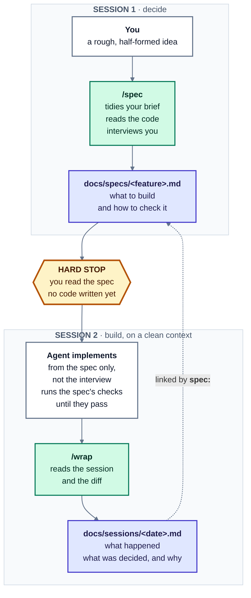

# agent-lifecycle-skills

**Interactive specs and session debriefs for AI coding agents.**

Bookend your agent sessions. `/spec` interviews you *before* the work and writes a task
contract. `/wrap` debriefs the session *after* and records what was decided, changed, and
verified. Both behave identically in Claude Code, Codex CLI, Cursor, and anything that reads
`AGENTS.md`.



<sub>Two sessions, on purpose. `/spec` decides what to build and then stops; a **fresh**
session builds it, reading the finished spec and none of the discarded drafts that produced
it. `/wrap` closes the loop and links its record back to the spec.</sub>

## Why

Most agent failures are not model failures. They are ambiguous requirements at the start and
lost context at the end — you explain the constraint once, the agent drifts, and three
sessions later nobody remembers why the retry policy looks like that. The diff records what
changed and nothing records why.

These are two lightweight, repository-native commands that close both ends:

- **`/spec`** draws out what you actually want — edge cases, constraints, acceptance criteria,
  and the runnable checks that prove them — into a task contract the implementing session can
  work against on its own.
- **`/wrap`** reads the session and the diff and writes down the decisions, the rejected
  alternatives, what was verified, and what the next agent needs to know.

Everything is plain Markdown committed to your repo. No service, no database, no lock-in.

## Install

```bash
git clone git@github.com:imanassi/agent-lifecycle-skills.git
./agent-lifecycle-skills/sync.sh /path/to/my-project
```

| Agent | Commands |
| --- | --- |
| Claude Code, Cursor | `/spec`, `/wrap` |
| Codex CLI | `$spec`, `$wrap` |
| Gemini CLI, Aider, Windsurf, Copilot, … | via `AGENTS.md` |

Then fill in the **Verification commands** block that `sync.sh` appends to your `AGENTS.md` —
the build and test commands for that project. Specs reference them instead of repeating them.

### Updating

The same command. There is no separate install/update mode to remember:

```bash
git -C agent-lifecycle-skills pull
./agent-lifecycle-skills/sync.sh /path/to/my-project
```

A project with none of the files gets a fresh install; a project that already has them gets an
update. Updating is conservative, because the two format specs are *meant* to be edited:

| | |
| --- | --- |
| `create` | wasn't there — added |
| `current` | already matches upstream — nothing to do |
| `update` | you never edited it, so it is refreshed in place |
| `yours` | **you edited it** — yours is kept untouched, the new version lands beside it as `<file>.new` |

Nothing you wrote is ever overwritten, on this run or any later one. Diff a leftover when you
want the newer wording, then delete it:

```bash
git diff --no-index docs/specs/README.md docs/specs/README.md.new
```

`--dry-run` shows what would happen and writes nothing. A project installed before `sync.sh`
existed has no manifest, so every differing file is treated as edited — `.new` files to diff
rather than silent in-place changes. That happens once; afterwards it tracks properly.

## What `/spec` does

1. **Asks what you are trying to achieve**, before proposing anything. The brief is expected
   to be half-formed; the agent helps draw it out — what triggered this, what you already
   tried, what "fixed" looks like. What it will not do is hand you a solution first.
2. **Tidies your brief and shows it back.** Wording only — nothing added, no ambiguity
   resolved, your hedges left intact. You agree it, then it freezes.
3. **Reads the relevant code**, so it does not waste your attention on questions the
   repository could answer.
4. **Interviews you in at most three batched rounds**, opening with the expensive-to-change
   things: the contract, the data model, the rollout, and how success gets checked.
5. **Writes the spec and stops.** No implementation, and no offer to implement.

The spec has ten sections. `## Brief` keeps your own framing, frozen. `## Acceptance criteria`
says what must be true; `## How to verify` says how an agent checks that for itself, and what
has to be stood up first. `## Out of scope` is the one that saves the most rework.

## What `/wrap` does

Reconstructs the session from the conversation and the diff, then writes: intent, decisions
with their rejected alternatives, changes (calling out migrations, config keys, new
dependencies, and deploy-order constraints), per-criterion verification status, open risks,
and a section for the next agent — the non-obvious thing that would otherwise cost it an hour
to rediscover.

If the session departed from its spec, it has to say so and say whether the spec is now stale.
That sentence is the most valuable line either document will ever contain.

## Layout

```
docs/specs/README.md          ← spec format. Single source of truth. Edit this.
docs/specs/_TEMPLATE.md
docs/specs/<slug>.md          ← specs. Named by feature. Mutable.

docs/sessions/README.md       ← wrap format. Single source of truth. Edit this.
docs/sessions/_TEMPLATE.md
docs/sessions/YYYY-MM-DD-*.md ← wraps. Named by date. Append-only.

.agents/skills/spec/SKILL.md  ← the procedure, agent-independent
.agents/skills/wrap/SKILL.md
.claude/skills/*/SKILL.md     ← two-line pointers at the above
AGENTS.md                     ← fallback for everything else, plus build commands

examples/                     ← a filled-in spec and the wrap that implemented it
```

## How it stays generic

One procedure per command, in `.agents/skills/<cmd>/SKILL.md`. One format definition per
document type, in `docs/*/README.md`. Every agent runs the same procedure against the same
format; nothing agent-specific lives in either.

`.agents/skills/` is the [Agent Skills](https://agentskills.io) open standard — Codex scans it
at the repo root and Cursor reads it natively, so one file covers both. Claude Code does not
read that path, so `.claude/skills/` holds two-line files whose entire body is *"read the
`.agents` one and follow it."* That is the only concession to a specific tool, and it carries
no behaviour.

Nothing is duplicated, so nothing can drift. Change `docs/specs/README.md` and every agent
picks it up on the next invocation.

## Three design decisions worth knowing

**You say what you want before the agent proposes anything.** An agent that opens with a
suggestion — *"sounds like you want exponential backoff, shall I write that up?"* — hands you
an answer to anchor on, and the rest of the interview measures its idea rather than yours.
Questions that draw your framing out are the job; supplying it is not.

**`/spec` stops.** It does not offer to continue, because an offer arriving at the moment of
maximum momentum is answered yes every time — so "offer" is just "continue" with a fig leaf.
It stops so implementation begins from a clean context: the interview leaves the agent's own
rejected proposals sitting in the window, and a model drifts back toward its earlier reasoning
more readily than toward a correction you made once in passing. A fresh session that has read
the finished spec and none of the discarded drafts does better work. The stop is made cheap —
the command ends by printing the line to paste. Say "and start now" to override.

**`model:` defaults to `unknown`.** Agents frequently do not know which model is serving them;
the serving model can differ from the configured one and change mid-session. Both formats tell
them to write `unknown` unless certain and never to guess a marketing name. Fewer populated
fields, but the populated ones are true.

## Specs are mutable, wraps are not

A wrap is history: dated, written once, never edited, valuable precisely because it is an
honest record of a moment. A spec is a living document: you approve it, build, learn the third
decision was wrong, revise it. Share a folder between them and you get either stale immutable
specs or edited wraps that stop being trustworthy.

The link between them is the `spec:` field in a wrap's frontmatter:

```bash
grep -rl "docs/specs/payment-retry" docs/sessions/   # every session on one spec
grep -l  "^status: abandoned" docs/sessions/*.md     # every approach we dropped
grep -l  "^status: approved"  docs/specs/*.md        # agreed but not yet built
```

See [`examples/`](examples/) for a spec and the wrap that implemented it — including a session
that deviated from its spec and said so.

## License

MIT
