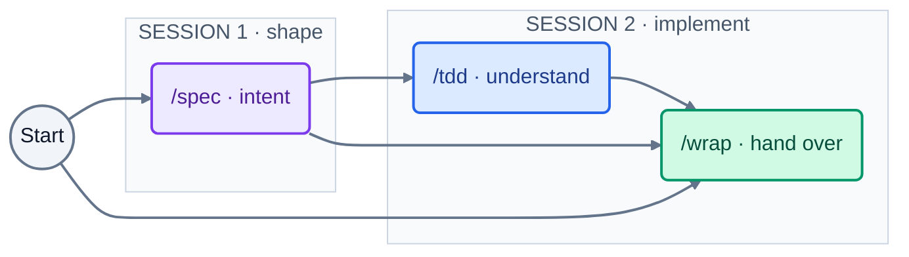

# agent-lifecycle-skills

**Build a better idea, understand the implementation, and leave a useful handover.**

Three skills help at different points in an AI coding session:

| Skill | Purpose | When to use it |
| --- | --- | --- |
| `/spec` | **Build a better idea.** Explore the problem, agree on the outcome, and write a spec so implementation can start in a clean session. | When the idea needs shaping or there are important choices to make. |
| `/tdd` | **Build your understanding.** Review concrete test scenarios and expected behavior before the agent implements, then trace the result through the code. | Optional for direct tasks; generated specs request it by default. |
| `/wrap` | **Capture intent and hand over.** Record why changes were made, what was verified, and what the next person or agent needs to know. | At the end of any session worth preserving, with or without a spec. |

**A bug fix or minor change can start directly in the implementation session.** You do not
need to write a spec first. Use the skills that fit the work; all three use the same
instructions in Claude Code, Codex CLI, Cursor, and agents that read `AGENTS.md`.


```mermaid
---
config:
  flowchart:
    curve: basis
    nodeSpacing: 30
    rankSpacing: 40
---
flowchart LR
    START((Start))

    subgraph S1["SESSION 1 · shape"]
        SPEC("/spec · intent")
    end

    subgraph S2["SESSION 2 · implement"]
        TDD("/tdd · understand")
        WRAP("/wrap · hand over")
    end

    START --> SPEC --> TDD --> WRAP
    SPEC --> WRAP
    START --> WRAP

    style START fill:#f1f5f9,stroke:#64748b,stroke-width:2px,color:#0f172a
    style SPEC fill:#ede9fe,stroke:#7c3aed,stroke-width:2px,color:#4c1d95
    style TDD fill:#dbeafe,stroke:#2563eb,stroke-width:2px,color:#1e3a8a
    style WRAP fill:#d1fae5,stroke:#059669,stroke-width:2px,color:#064e3b
    style S1 fill:#f8fafc,stroke:#cbd5e1,stroke-width:1px,color:#475569
    style S2 fill:#f8fafc,stroke:#cbd5e1,stroke-width:1px,color:#475569
    linkStyle default stroke:#64748b,stroke-width:2px
```

When you use `/spec`, the two sessions have different jobs: shape the idea, then build from
the finished spec in a **fresh context**, without the discarded interview drafts. For a
clear bug fix or minor change, skip session 1. `/tdd` can work from either a spec or the task
itself; it is optional unless the spec or project requires it. `/wrap` preserves the intent
and handover in either path, linking to a spec when one exists.

## Why

Most agent failures are not model failures. They are ambiguous requirements at the start and
lost context at the end — you explain the constraint once, the agent drifts, and three
sessions later nobody remembers why the retry policy looks like that. The diff records what
changed and nothing records why.

There is also a gap in the middle: code can pass its tests while you still do not understand
what it does or why. As Andrej Karpathy puts it, quoting a line he keeps returning to:

> You can outsource your thinking, but you can't outsource your understanding.

— [Andrej Karpathy, Sequoia Ascent 2026](https://karpathy.bearblog.dev/sequoia-ascent-2026/)

`/tdd` gives you a concrete way to stay involved: examine scenarios, question the expected
outcomes, and follow the resulting code. Passing tests provides evidence of behavior;
reviewing and explaining that behavior builds understanding. `/spec` helps you decide what
is worth building, and `/wrap` preserves the intent behind what you built for the next handover.

Everything is plain Markdown committed to your repo. No service, no database, no lock-in.

## Install

```bash
git clone git@github.com:imanassi/agent-lifecycle-skills.git
./agent-lifecycle-skills/sync.sh /path/to/my-project
```

| Agent | Commands |
| --- | --- |
| Claude Code, Cursor | `/spec`, `/tdd`, `/wrap` |
| Codex CLI | `$spec`, `$tdd`, `$wrap` |
| Gemini CLI, Aider, Windsurf, Copilot, … | via `AGENTS.md` |

Then fill in the **Verification commands** block that `sync.sh` appends to your `AGENTS.md` —
the build and test commands for that project. Specs reference them instead of repeating them.

### Updating

The same command. There is no separate install/update mode to remember:

```bash
git -C agent-lifecycle-skills pull
./agent-lifecycle-skills/sync.sh /path/to/my-project
```

A project with none of the files gets a fresh install; a project that already has them gets an
update. Updating is conservative, because the two format specs are *meant* to be edited:

| | |
| --- | --- |
| `create` | wasn't there — added |
| `current` | already matches upstream — nothing to do |
| `update` | you never edited it, so it is refreshed in place |
| `yours` | **you edited it** — yours is kept untouched, the new version lands beside it as `<file>.new` |

Nothing you wrote is ever overwritten, on this run or any later one. Diff a leftover when you
want the newer wording, then delete it:

```bash
git diff --no-index docs/specs/README.md docs/specs/README.md.new
```

**Commit `.agents/.agent-lifecycle-skills.manifest`.** It records which upstream version each
file came from, and it is what lets a later sync tell your edits from staleness. Leave it
untracked and every teammate's first sync sees no baseline and reports the whole set as
`yours`.

`--dry-run` shows what would happen and writes nothing. A project installed before `sync.sh`
existed has no manifest, so every differing file is treated as edited — `.new` files to diff
rather than silent in-place changes. That happens once; afterwards it tracks properly.

## What `/spec` does

Use it to turn a rough idea into a clear starting point for a fresh implementation session.
If the task is already clear, such as a small bug fix or minor change, start implementing
directly. A spec is useful when there is something to work out, not a prerequisite for every edit.

1. **Asks what you are trying to achieve**, before proposing anything. The brief is expected
   to be half-formed; the agent helps draw it out — what triggered this, what you already
   tried, what "fixed" looks like. What it will not do is hand you a solution first.
2. **Tidies your brief and shows it back.** Wording only — nothing added, no ambiguity
   resolved, your hedges left intact. You agree it, then it freezes.
3. **Reads the relevant code**, so it does not waste your attention on questions the
   repository could answer.
4. **Interviews you in at most three batched rounds**, opening with the expensive-to-change
   things: the contract, the data model, the rollout, and how success gets checked.
5. **Writes the spec and stops.** No implementation, and no offer to implement.

The spec has eleven sections. `## Brief` keeps your own framing, frozen. `## Acceptance criteria`
says what must be true; `## How to verify` says how an agent checks that for itself, and what
has to be stood up first. `## Out of scope` is the one that saves the most rework. A final `## Jira summary`
translates the finished spec into business language: problem, proposed outcome, observable
success, and material limitations. The same ready-to-paste text ends the agent's response,
so it can go straight into a Jira description or comment. It is not posted automatically.

## Ticket context and human understanding

Configure the tracker, issue-key convention, available connector or CLI, and posting policy
in the project's `AGENTS.md` using `AGENTS.md.snippet`. `/spec` can begin from a ticket ID or
URL and reads relevant context before interviewing. Without access, paste the ticket text.
Tickets own priority, assignment, and team status; specs own the agreed technical approach;
wraps record history. Stable acceptance IDs connect requirements to tests and results.

`/wrap` includes a short code-reading route and a ticket-ready update with available links.
Posting requires explicit authorization. Tests passing does not automatically close tickets.
Existing installations preserve project-owned `AGENTS.md`; copy the new TDD and Team ticketing
blocks from the snippet when updating. Historical specs and wraps remain valid as written.

## Reading specs and history without importing stale instructions

Start with the current request and linked spec or ticket. Select additional documents by
ticket ID, spec reference, or affected code, checking status and scope before reading them
in full. Do not automatically load recent wraps. If no relevant history appears, continue
with the code and current request.

Specs describe intent; code and executed tests provide evidence of current behavior; wraps
explain history. Surface material disagreements before making the disputed change. Drafts
need agreement, approved specs govern their associated work, implemented specs record intent
at delivery, and superseded specs point to replacements. Historical commands and next steps
do not authorize new actions. New wraps label these notes **Historical context for future
work**; older wraps remain unchanged.

Existing installations keep their project-owned `AGENTS.md`. Replace its old recency-based
reading paragraph with the new **How to use specs and session history** block from
`AGENTS.md.snippet`. The skills also point to the guidance in `docs/specs/README.md`.

## What `/tdd` does

Use `/tdd` when you want tests and human review to help you understand the intended behavior
before implementation. It works from a spec **or an agreed task**; no new spec is needed.
For direct tasks, this workflow is optional unless your project requires it.

Generated specs request TDD by default: the fresh-session prompt and the spec's **How to
verify** section direct the implementing agent to this skill. Follow that requirement when
implementing such a spec, unless you explicitly change it.

1. Write behavior tests mapped to acceptance IDs and run them to establish meaningful failures.
2. Present a small set of scenarios, expected outcomes, test references, and observed failures.
3. Wait for explicit human approval of expectations before writing implementation code.
4. Implement, then refactor with approved tests passing. Changed expectations return for review.
5. Report results and a reading route through the code. An interactive walkthrough is optional.

The checkpoint is required by default and can be explicitly waived. Asking to start work does
not itself waive it. Manual-only behavior needs an agreed scenario, reviewer, and timing.
Approval concerns the intended behavior; the agent remains responsible for test execution.

## What `/wrap` does

Capture the intent behind the changes and leave a useful handover for the next person or
agent. It works after any implementation session, including bug fixes and minor changes
that used neither `/spec` nor `/tdd`.

Reconstructs the session from the conversation and the diff, then writes: intent, decisions
with their rejected alternatives, changes (calling out migrations, config keys, new
dependencies, and deploy-order constraints), per-criterion verification status, open risks,
and a section for the next agent — the non-obvious thing that would otherwise cost it an hour
to rediscover.

If the session departed from its spec, it has to say so and say whether the spec is now stale.
That sentence is the most valuable line either document will ever contain.

## Layout

```
docs/specs/README.md          ← spec format. Single source of truth. Edit this.
docs/specs/_TEMPLATE.md
docs/specs/<slug>.md          ← specs. Named by feature. Mutable.

docs/sessions/README.md       ← wrap format. Single source of truth. Edit this.
docs/sessions/_TEMPLATE.md
docs/sessions/YYYY-MM-DD-HHMM-<slug>.md   ← wraps. Append-only.
                                 date+time orders them; the slug describes the work
                                 and starts with the spec's slug when there is one.

.agents/skills/spec/SKILL.md  ← the procedure, agent-independent
.agents/skills/wrap/SKILL.md
.agents/skills/tdd/SKILL.md
.claude/skills/*/SKILL.md     ← pointers at the above
AGENTS.md                     ← fallback for everything else, plus build commands

examples/                     ← a filled-in spec and the wrap that implemented it
```

## How it stays generic

One procedure per command, in `.agents/skills/<cmd>/SKILL.md`. One format definition per
document type, in `docs/*/README.md`. Every agent runs the same procedure against the same
format; nothing agent-specific lives in either.

`.agents/skills/` is the [Agent Skills](https://agentskills.io) open standard — Codex scans it
at the repo root and Cursor reads it natively, so one file covers both. Claude Code does not
read that path, so `.claude/skills/` holds pointer files whose entire body is *"read the
`.agents` one and follow it."* That is the only concession to a specific tool, and it carries
no behaviour.

Nothing is duplicated, so nothing can drift. Change `docs/specs/README.md` and every agent
picks it up on the next invocation.

## Three design decisions worth knowing

**You say what you want before the agent proposes anything.** An agent that opens with a
suggestion — *"sounds like you want exponential backoff, shall I write that up?"* — hands you
an answer to anchor on, and the rest of the interview measures its idea rather than yours.
Questions that draw your framing out are the job; supplying it is not.

**`/spec` stops.** It does not offer to continue, because an offer arriving at the moment of
maximum momentum is answered yes every time — so "offer" is just "continue" with a fig leaf.
It stops so implementation begins from a clean context: the interview leaves the agent's own
rejected proposals sitting in the window, and a model drifts back toward its earlier reasoning
more readily than toward a correction you made once in passing. A fresh session that has read
the finished spec and none of the discarded drafts does better work. The stop is made cheap —
the command ends by printing the line to paste. Say "and start now" to override.

**`model:` defaults to `unknown`.** Agents frequently do not know which model is serving them;
the serving model can differ from the configured one and change mid-session. Both formats tell
them to write `unknown` unless certain and never to guess a marketing name. Fewer populated
fields, but the populated ones are true.

## Specs are mutable, wraps are not

A wrap is history: dated, written once, never edited, valuable precisely because it is an
honest record of a moment. A spec is a living document: you approve it, build, learn the third
decision was wrong, revise it. Share a folder between them and you get either stale immutable
specs or edited wraps that stop being trustworthy.

When a session implements a spec, the `spec:` field in the wrap's frontmatter links them.
For work without a spec, use `spec: null`; the wrap still records intent, decisions, and the
handover. To find sessions linked to a spec:

```bash
grep -rl "docs/specs/payment-retry" docs/sessions/   # every session on one spec
grep -l  "^status: abandoned" docs/sessions/*.md     # every approach we dropped
grep -l  "^status: approved"  docs/specs/*.md        # agreed but not yet built
```

See [`examples/`](examples/) for a spec and the wrap that implemented it — including a session
that deviated from its spec and said so.

## License

MIT
